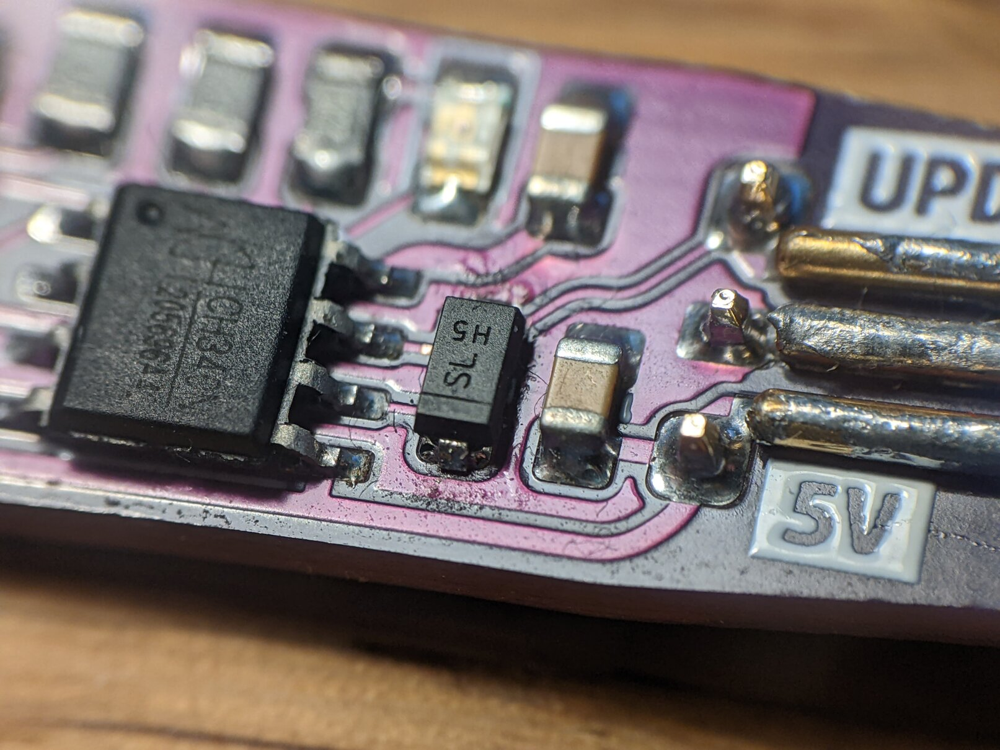

# Errata

## updipogo_v1

### Switched USB Polarity

On the first order I somehow mixed up USB `D+` and `D-`.

Cut the traces next to the serial chip and use thin enamelled wire to connect the receptacle correctly.


## updipogo_v2

### Replace the 4.7kΩ Resistor with a Diode

After soldering my v2 board I found that it doesn't reliably work with all my targets:

* `updiprog` wouldn't work at all?
* Soldering a "dummy" pogo plug and connecting `GND`, `VCC`, `TX`, `RX` and `RTS` to the pins of an FTDI adapter I found that an FT232R *can* "hear itself" (opening a console with no target connected and typing characters to see them echoed back) while an FT232H *could not*.
* `pymcuprog` works with an ATtiny414 but **not** with an AVR32DB48

Then I found [a lengthy manual on UPDI by SpenceKonde](https://github.com/SpenceKonde/AVR-Guidance/blob/master/UPDI/jtag2updi.md#connections), which also mentions different connection schemes with resistors and diodes. I shorted the resistor with tweezers and suddenly more of the above combinations worked.

I must admit, I do not fully grasp all the different combinations and since both target and programmer were designed by me, I *know* there are no external resistors in the UPDI path. So 4.7kΩ *should* have worked fine.

Anyway. I switched the resistor for a Shottky Diode (with the band towards `TX`) and started using `pymcuprog` exclusively. Now every combination works, both with the dummy plug and a fully populated updipogo_v2.

```
---------------+
            DTR|                           __________________
            Rx |------------,------------>| UPDI
  CH340N    Tx |-----|<|---'      .------>| Gnd   Target
            VCC|------------------------->| Vcc
            CTS|                 .`       |__________________
            Gnd|----------------'
---------------+
```


