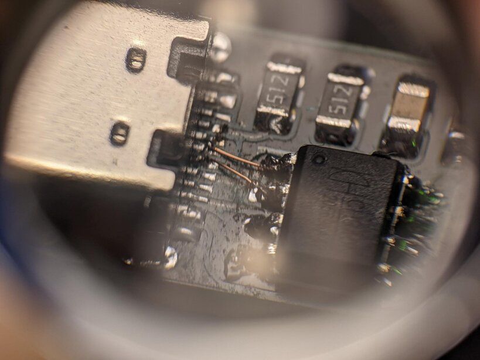

# Errata

## updipogo_v1

### Switched USB Polarity

On the first order I somehow mixed up USB `D+` and `D-`.

Cut the traces next to the serial chip and use thin enamelled wire to connect the receptacle correctly.

