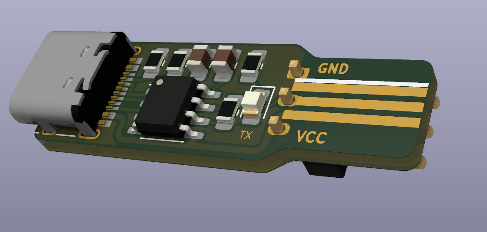
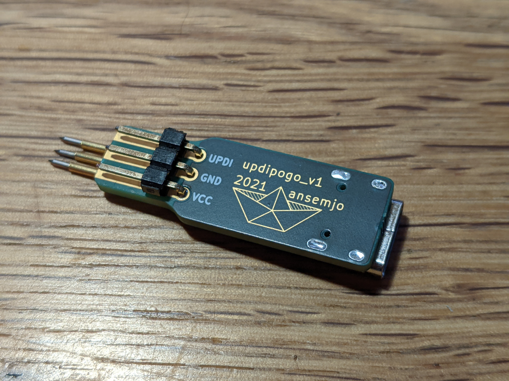
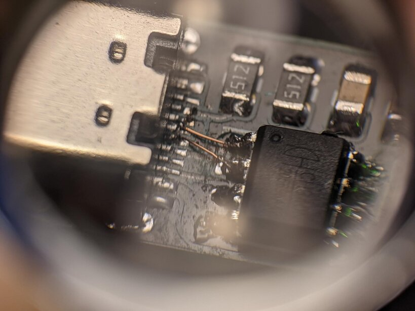

# updipogo

This was an idea to combine a tiny board with pogo pins (spring-loaded probes)
on one end and a cheap USB-to-UART chip to build an UPDI programmer. The idea
comes from a [Pnoxi AVR-ISP Pogo][pnoxi], which I use for programming of older
AVRs.

The pogo footprint uses a denser pitch of 1.6 mm so that programming pads on
future boards could require minimal space. The underside has footprints to add
pins with standard 2.54 mm pitch or even a small header, though.

Add small 0.4 mm vias in the middle of the three programming pads if you can
to give the spearhead tips something to fall into.

[pnoxi]: https://www.tindie.com/products/pnoxi/avr-isp-pogo-pin-adapter-2x3-idc2x3-pogo-254mm/

### err: usb polarity error

On the first order I somehow mixed up USB `D+` and `D-`. Cut the traces next to the serial chip and use thin enamelled wire to connect the receptacle correctly.

