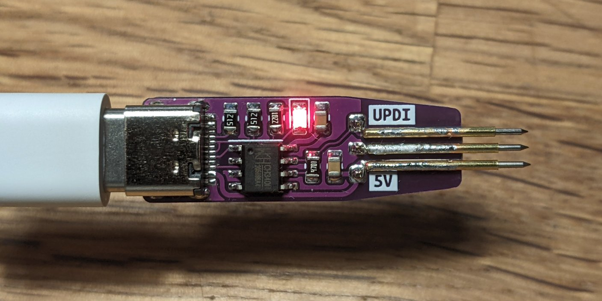
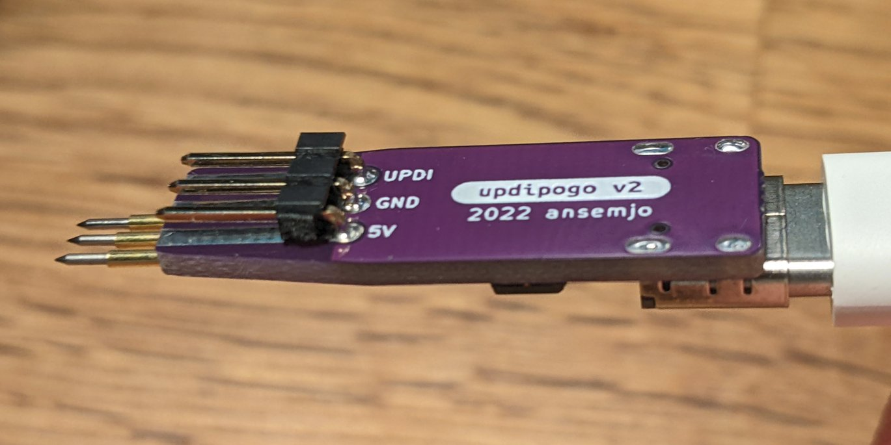
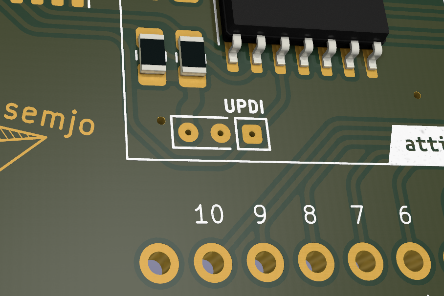

# updipogo

This was an idea to combine a tiny board with [pogo pins](https://aliexpress.com/item/1005002667659397.html) (spring-loaded probes) on one end and a cheap [CH340N USB-to-UART chip](https://lcsc.com/product-detail/USB-ICs_WCH-Jiangsu-Qin-Heng-CH340N_C2977777.html) on the other end, to build an [UPDI programmer](https://github.com/SpenceKonde/AVR-Guidance/blob/master/UPDI/jtag2updi.md). The idea stems from a [Pnoxi AVR-ISP Pogo][https://www.tindie.com/products/pnoxi/avr-isp-pogo-pin-adapter-2x3-idc2x3-pogo-254mm/], which I use for programming older AVRs.

### Programming Pads

The pogo footprint uses a somewhat dense pitch of 1.6 mm so that programming pads on future boards could require minimal space. The underside has footprints to add pins with standard 2.54 mm pitch or even a "normal" header, though.

Add small 0.4 mm vias in the middle of the three programming pads if you can to give the spearhead tips something to fall into.

### Alternatives

[Stefan Wagner lists a lot of possible UPDI programmer alternatives](https://github.com/wagiminator/AVR-Programmer). Those include voltage switching, HV capable programmers and `jtag2updi`-compatible ones.
